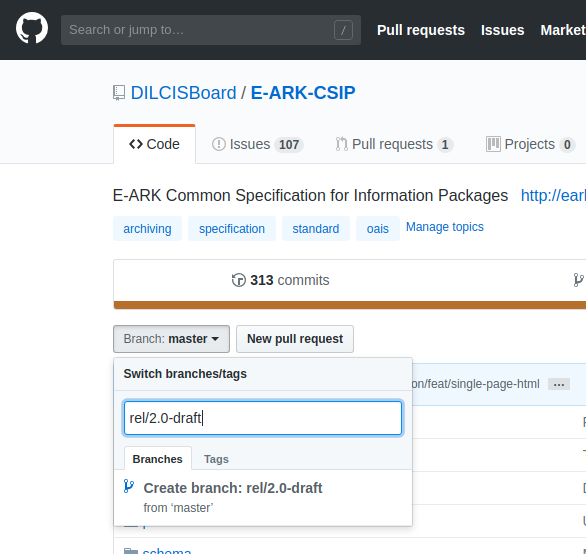

E-ARK Common Specification for Information Packages
===================================================

Quick Start
-----------

### Layout
```
E-ARK-CSIP/
Project root
  |
  |- README.md
  |  This documentation file.
  |
  |- index.md
  |  The Markdown source for the site home page.
  |
  |- archive/
  |  Archive of old versions of the specification (possibly schema, see TODOs).
  |
  |- examples/
  |  Sample information packages showing the Common Specification in use.
  |
  |- profile/
  |  The CSIP METS Profile and supporting documentation.
  |
  |- schema/
  |  DILCIS METS extensions and defined vocabularies for the CSIP.
  |
  |- specification/
  |  The Markdown source for the common specification.
  |
  |- utils/
     Tools and utilities used to create and QA the specification documents.
```

Publication Workflow
--------------------

## Requirement tables from Profile

## Prepare final copy Markdown

## Create and test web site

Git
---

### Master branch
The last public release of the specification.

### Integration branch
The in progress working branch for an up coming version.

### /rel/... branches
Snapshots of current and old releases,

### Maintenance

#### Create new git branch
1. From the repo home page ensure that the branch you wish to copy, in this case master, is selected.
2. Hit the pull down button and type the new branch name. In the image below we're creating the `rel/2.0-draft` branch.
3. Click the "Create branch: rel/2.0-draft" panel. The name will be that of the branch you're creating. Check the "from 'master'" tag to ensure you're cloning the branch you intend, in this case master.




TODO ?
------
- [ ] Decide if we want to retain old schema in the archive. Perhaps the archive should store previous versions of the specification site?
- [ ] Travis build and test
 + [ ] build and test requirement table generator
 + [ ] test generation of requirements and site
 + [ ] broken links test for site
 + [ ] spell check for text, if feasible and useful
- [ ] Navigation for specification documents
  + Possibly via GH pages YAML metadata
