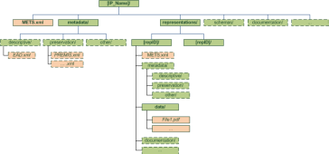
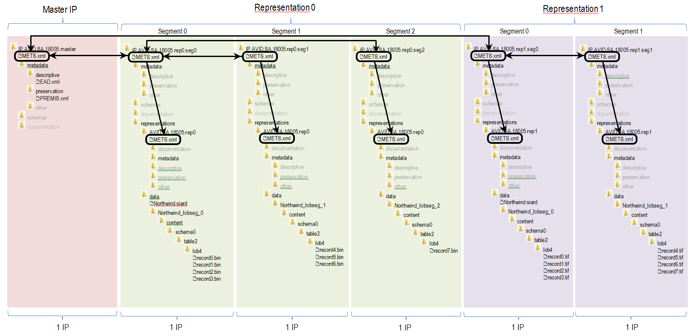
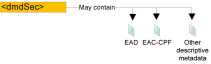

# PART II: Implementation of the CS IP

In this part of the document we present an implementation of the requirements and principles discussed in Part I of the CS IP. The implementation consists of two core elements: a fixed physical structure of a CS IP Information Package (Section 4) and the exact use of metadata in METS and PREMIS format (Section 5).

As explained above, any implementation is destined to be outdated sooner or later. However, the authors of the CS IP have made their best effort to reuse already available best practices and established core standards, and to carry out intensive discussions within the digital preservation community. All of the above should guarantee that the implementation can be used with only minor updates (for example minor updates to metadata elements) throughout the next few decades.

# 4.	CS IP structure
The preferred implementation of the conceptual model described in Requirement 3.6 is a fixed physical (folder) structure which follows exactly the conceptual structure. While the CS IP doesn't prohibited alternative implementations of the conceptual model such implementations aren't recommended.

The main reason for such an implementation decision is that a fixed physical folder structure makes it clear for both human users and tools where to find what. The main benefit of such a clear decision is that many archival tasks (for example file format risk analysis) can be executed directly on the data portion of the package structure, as opposed to first processing potentially large amounts of metadata for the locations of the files. This, in turn, allows for more efficient processing which is valuable in the case of large collections and bulk operations. In short, we believe that a fixed folder structure allows for more efficiency and scalability.

The authors of this specification are well aware that there are multiple data storage solutions which do not support explicit folder structures but use other means for structuring and storing (the content of) AIPs.
However, we would like to note that the purpose of this specification is to support Information Package interoperability. As such we believe that even if a storage solution does not allow implementing the physical folder structure as the native AIP storage structure, it is still possible to implement the physical structure described below for SIPs, DIPs and the import/export of AIPs. While the repository needs to support an extra transformation (i.e. Common Specification IP to internal AIP and vice versa), it allows still
to use the tools created by other users of the common specification, transfer AIPs more easily to new repository systems or storage solutions, and establish cross-repository duplicated storage solutions.

## 4.1.	Folder structure of the CS IP
The CS IP folder structure is presented in Figure 8 below. The structure follows directly the principles of the conceptual data model by dividing the components of the package into stand-alone folders for representations, metadata, and other components.

<a name="fig8"></a>


**Figure 8:** CS IP Information Package folder structure

The implementation requirements of the CS IP Information Package structure are:

**CSIP1:** Each CS IP Information Package MUST be included in a single physical folder (i.e. the “Information Package folder”). In other words: on the highest structural level a Common Specification IP MUST consist of one and only one folder;

**CSIP2:** The Information Package folder SHOULD be named with the ID or name of the Information Package;

**CSIP3:** The Information Package folder CAN be compressed (for example by using TAR or ZIP);

**CSIP4:** The Information Package folder MUST include a metadata file named `METS.xml`, which includes information about the identity and structure of the package and its components ;

**CSIP5:** The Information Package folder MUST include a folder named `metadata`, which MUST include at least all metadata relevant for the whole package

**CSIP6:** If preservation metadata are available, they SHOULD be included in sub-folder `preservation`;

**CSIP7:** If descriptive metadata are available, they SHOULD be included in sub-folder `descriptive`;

**CSIP8:** If any other metadata are available, they CAN be included in separate sub-folders, for example an additional folder named `other`.

**CSIP9:** The Information Package folder MUST include a folder named `representations`;

**CSIP10:** The `representations` folder MUST include a sub-folder for each individual representation (i.e. the “representation folder”) named with a string uniquely identifying the representation within the scope of the package (for example the name of the representation and/or its creation date could be good examples for an representation sub-folder) ;

**CSIP11:** The representation folder MUST include a sub-folder named `data` which includes all data constituting the representation ;

**CSIP12:** The representation folder CAN include a metadata file named `METS.xml` which includes information about the identity and structure of the representation;

**CSIP13:** The representation folder CAN include a sub-folder named `metadata` which CAN include all metadata about the specific representation

**CSIP14:** The Information Package folder and representation folder CAN be extended with additional sub-folders:

**CSIP15:** We recommend including XML Schemas for all metadata in XML format into the package. These schemas SHOULD be placed into the sub-folder called `schemas` within the Information Package folder;

**CSIP16:** We recommend including all additional (binary) documentation about the whole package or a specific representation into the package. Such documentation SHOULD be placed into the sub-folder called `documentation` within the Information Package folder and/or the representation folder;

**CSIP17:** Implementers CAN add any other folders either into the Information Package folder or the representation folder.

## 4.2.	Implementing the structure
The requirements presented in Section 4.1 leave room for quite a few decisions during implementation. For the sake of clarity we provide here examples for two extremes – the simplest and the full use of the structure.

In the simplest case the structure can be implemented following mostly just the MUST requirements. An example of this is visible on Figure 9.

<a name="fig9"></a>


**Figure 9:** Example of a simple use of the CS IP structure

The main point to highlight with such a simple use is that the representations have been kept as simple as possible. All metadata about both the package and the representations (in this example METS, EAD and
PREMIS metadata) are located in the Information Package folder and none of these components are available within the representation folders.

Such a simple implementation is reasonable in scenarios where the amount of data and metadata is limited. However, in the case of large Information Packages (for example, a package including three representations and 1,000,000 files in one representation) the size of both the `METS.xml` file and preservation metadata can grow too large to manage efficiently. Especially in such large data scenarios it might prove necessary to implement all the capabilities of the structure presented in the previous Section.

An example of the full implementation is delivered in Figure 10. The main difference between the simple and full use of the structure is that each representation does essentially repeat the simple structure. Especially structural and preservation metadata in METS and PREMIS formats is available in both the Information Package folder (for package level descriptions) and within representation folders (for representation level descriptions). As such the full structure allows for easier management of single representations and brings further benefits like more straight-forward metadata versioning. It is worth to note that, in order to avoid confusion, it is recommended to have a common approach towards adding metadata into representations or not. In other words, we recommend having all representation-relevant metadata either in the root metadata folder or the representation metadata folder, but not to have a mixed approach (i.e. some representation metadata in the root metadata folder and some within the representation). Further, we do not recommend the duplication of any metadata or the content of optional folders (schemas, documentation, etc.) between the Information Package folder and representation folders.

<a name="fig10"></a>


**Figure 10:** Example of the full use of the CS IP structure
 
 
## 4.3 Segmenting IPs
Segmentation of an IP can be necessary due to the size of an IP, i.e. the file size. An IP in a single file or folder with a size of several GB or even TB can be difficult and inefficient to manage.
## 4.3.1 The structure for IP, their representations and their segments
According to the Common Specification for IPs, an IP can have several representations.
All representations contains the same intellectual content, but as the name implies is another representation; in its most simple form this could be another file format such as TIFF instead of JPEG.
As the content resides in the representations of the IP any segmenting due to size and amount of files will have to take place at the level of the representations.
According to the Common Specification each representation of an IP has to be an IP itself.
Further, a segment of an representation must also be an IP itself.
In order to have an efficient hierarchy of IPs this section  states that a segmented IP can have a master IP which refers to its representations by referring to the first segment IP of a representation. The first segment IP of a representation refers to the following segments by referring to the their IP.
## 4.3.2 Using METS to refer from parent IP to child IP(s)
The method used to refer from parent to child is based on the ID of the IP of the child.
One reason for using ID and not URL or other more direct references to a location of the referenced METS file is the flexibility it gives to move the segmented IPs around in different storage locations. This is a flexibility often needed for segmented IPs that accumulated can be very large.
The value of the xlink:href attribute in the <mptr> element in the METS file of the parent IP is used.
This value is to be set to the value of the OBJID attribute of the <mets> element in the METS file of the child IP. According to the Common Specification, the OBJID attribute must have the value of the ID of the IP.
This is therefore sufficient for having the parent know the ID of the child, but the parent does not know the exact child location.
## 4.3.3 Using METS to refer from child IP to parent IP
The optional reference from child to the parent is based on the ID of the IP of the parent.
The value of the xlink:href attribute in <mptr> element in the METS file of the child IP is used.
This value is to be set to the value of the OBJID attribute of the <mets> element in the METS file of the parent IP. According to the Common Specification, the OBJID attribute must have the value of the ID of the IP.
This is therefore sufficient for having the child know the ID of the parent, but the child does not know the exact parent location.
## 4.3.4 An example for the Northwind database
Here follows a partial example, where the value of the xlink:href attribute in the <mptr> element (inside the <div> element inside the <structMap> element) is “ID.AVID.RA.18005.rep0.seg0” after the urn NID part (urn:<NID>:<NSS>).  
The value “ID.AVID.RA.18005.rep0.seg0” must now match the value of the OBJID attribute for the <mets> element in the child IP root METS file.
(Note that in order to save space in this example the CS mandatory ID attribute for the <div> elements have been left out.)
## 4.3.4.1 Parent IP mets file
```xml
<div LABEL="representations">
	<div LABEL="representations/ID.AVID.RA.18005.rep0" ORDER="0" >
		<div LABEL="child IP" TYPE="representation child">
			<mptr xlink:href="urn:sa.dk:ID.AVID.RA.18005.rep0.seg0" 
			xlink:title="root level METS file for representation 0" xlink:type="simple" LOCTYPE="URN"/> 
		</div>
	</div>
	<div LABEL="representations/ID.AVID.RA.18005.rep1" ORDER="1">
		<div LABEL="child IP" TYPE="representation child">
			<mptr xlink:href="urn:sa.dk:ID.AVID.RA.18005.rep1.seg0"
			 xlink:title="root level METS file for representation 1" xlink:type="simple" LOCTYPE="URN"/>
		</div>	
	</div>	
</div>	
```
```xml
<!-- this top root level METS.xml IP only refers to the root level METS files in the representations using the <mptr> element -->	
<!-- we use the attribute LABEL value 'child IP' in the 'div' element for representations in accordance with the AIP spec.3.3.1.9 -->
<!-- each root level METS file in the representations refer to its own METS files in the segments and in the representations folder using the <mptr> element -->			
<!-- we use the attribute LABEL value 'segment' in the 'div' element for representations-->
<!-- we have no CHECKSUM for these METS files because the mptr does not allow it and because the <file> element in the <fileGrp> in the <fileSec> apparently is only to be used for files inside the package -->
<!-- the value of the attribute LABEL is the ID of the representation -->
<!-- representation 0 - images in jpg format -->	
<!-- this is a METS reference to another METS file, and this file is in another segment - compare with CS v0.13 sec. 5.2, p 36 -->
<!-- the value of the attribute LABEL is the ID of the representation -->
<!-- representation 1 - a migration to tif -->
<!-- this is an indirect METS reference to another METS file, and this file is in another segment - compare with CS v0.13 sec. 5.2, p 36 -->
```  

## 4.3.4.2 Child IP METS file
<mets xmlns:xsi="http://www.w3.org/2001/XMLSchema-instance" xmlns="http://www.loc.gov/METS/" xmlns:xlink="http://www.w3.org/1999/xlink" 
xsi:schemaLocation="http://www.loc.gov/METS/ schemas/mets.xsd"
PROFILE="http://www.ra.ee/METS/v01/IP.xml" TYPE="SIP" OBJID="ID.AVID.RA.18005.rep0.seg0" LABEL="root level METS file for a representation segment">
..
..
..
<div LABEL="parent IP" TYPE="Godfather IP"> <!-- working title - maybe master IP is more appropriate -->
	<mptr xlink:href="urn:sa.dk:ID.AVID.RA.18005.godfather" xlink:title="root level METS file for godfather IP" xlink:type="simple" LOCTYPE="URN"/>
	<!-- this is an indirect METS reference to another METS file, and this file is in another segment - compare with CS v0.13 sec. 5.2, p 36 -->
</div>	 			

## 4.3.5 Illustration of reference between METS files in a segmented IP
We need to segment an IP at the data folder in the representations level, but reading the Common Specification strictly means this can only be done at the IP level. Therefore this IP has been segmented at the top IP level, and not at the representations level.

LINK TO IMAGE

The illustrated folder structure follows the Common Specification, ver. 0.13 section 4.2 and note 8, about not having to include all representations in one package.
The Master IP MUST NOT contain representations. 
A representation MAY be segmented.
The IDs are not just unique but have implicit value for example purposes only. 
In representation 0 the limits on folder size and amount of files requires three segments (0, 1 and 2).
In representation 1 these limits have been increased and we only need two segments. Further the .bin files have been migrated to .tif

# 5. Use of metadata
## 5.1. General requirements for metadata in a CS IP Information Package
The number one consideration when discussing metadata requirements is, as with the rest of this specification, the need for interoperability. In more detail, the focus is on high-level technical interoperability and tasks which allow an Information Package to be prepared, transferred and received regardless of the institutions and tools involved. These tasks include:

- Identifying uniquely an Information Package and its components;
- Validating an Information Package;
- Validating the contents of an Information Package;
- Proving the authenticity of the Information Package;
- Accessing the contents of an Information Package.

In more technical terms the CS IP makes an effort to control metadata which allows any tool or user to negotiate the data and metadata components of the package (i.e. packaging metadata), to validate that no component has come to harm during transfer or preservation (i.e. fixity information), to understand the processes behind the creation and management of the package (i.e. provenance and preservation metadata) and finally to understand how the data within the package could be accessed (i.e. representation information).

Most crucially, we regard descriptive metadata and most of detailed technical metadata to not belong in the scope of the CS IP. As such, the CS IP itself does not aim to provide detailed semantic interoperability between different systems. However, as noted in Section 1.2, implementers are welcome to use the
construct of Content Information Type Specifications to achieve an even higher level of interoperability.

Some of the core metadata requirements are already visible from the structure presented in the previous Section. Most crucially the CS IP requires that all Information Packages MUST include one and only one METS file in the Information Package folder of the package, named `METS.xml`. In addition, the package CAN include one `METS.xml` file in each of the representation folders. These files will be referred to as “root METS” and “representation METS” respectively in the rest of this document. The detailed specification of using METS within the CS IP is available in Section 5.3.

In addition to the METS files the CS IP recommends the inclusion of PREMIS metadata in appropriate preservation metadata folders. This is especially relevant when aiming for an interoperable approach towards provenance and access to Information Packages. However, we recognise that, especially in the
case of SIPs, appropriate preservation metadata is not always available. As such this is also not an absolute requirement though highly desirable. The detailed specification of the use of PREMIS within the CS IP is available in Section 5.4.

The use of any additional metadata is not restricted in CS IP Information Packages.

## 5.2.	General requirements for the use of metadata
Before we describe the detailed requirements for the use of METS and PREMIS we would like to highlight some general aspects which need to be implemented commonly across all metadata.

### The use of identifiers
The ID data type in XML does define that a legit value must begin with a letter, or the underscore character (‘_’), and contain no characters other than letters, digits, hyphens, underscores, full stops, and certain combining and extension characters. To overcome this limitation and in order to allow for interoperable package identification all identifiers within Common Specification metadata MUST start with a prefix, followed by the actual value of the identifier.

Examples:

Example 1: using a prefix which consists of the abbreviation of the identifier and a hyphen.

```xml
<dmdSec ID="uuid-906F4F12-BA52-4779-AE2C-178F9206111F" CREATED="2018-04-
24T14:37:49.609+01:00">
```

Example 2: using a fixed prefix “ID”
```xml
<dmdSec ID="ID906F4F12-BA52-4779-AE2C-178F9206111F" CREATED="2018-04-
24T14:37:49.609+01:00">
```

Note that identifier-type elements and attributes specified within the CS IP are mainly used for internal referencing between the components of an Information Package. As such there is no need to require the use of any specific prefix syntax but it is required that any selected prefix is used
consistently throughout the package.

### Referencing between files within a CS IP Information Package
This specification recommends strongly to format all components of the information package (i.e. all data, metadata and other parts) as distinct computer files within the package. While such an approach simplifies the overall management of the Information Package and makes it easier to
include, validate and modify the package, it also brings the need for a clear method for referencing between these various files.

For example, the METS specification requires for referencing to:

- descriptive and administrative metadata files described in the `amdSec` and dmdSec elements;
- content (data) files, components of documentation and schemas described in the `fileSec` element;
- representation METS files described in the root METS file’s `structMap` element.

A common approach towards referencing between metadata, and between metadata and other components of the package, is one of the core needs in Information Package validation and integrity checking. Different technical solutions are available for referencing and not all of these are supported across all digital preservation tools.

In order to guarantee interoperability, all references within a CS IP Information Package must follow the requirements below:
- in all occurrences of the METS `@LOCTYPE` attribute the value of it MUST be “URL”;
- the W3C recommendation XML Linking Language (XLink) version 1.1  MUST be used for expressing references in metadata;
  - The XLink `@type` attribute MUST be used with the fixed value “simple”;
  - The value of the XLink `@href` attribute MUST be expressed as a valid URI according to RFC 3986 ;
  - Further, the value of the XLink `@href` attribute SHOULD NOT use the protocol part of the URI (e.g. `file://` or `http://`) and, in this case, MUST be interpreted as a relative path to the file (from the metadata file into which the reference is included).

Example:
```xml
<mdRef LOCTYPE="URL" xlink:type="simple" xlink:href="metadata/preservation/premis2.xml"
... />
```

### Referencing other packages
As with internal referencing it is crucial that external references to other related packages are expressed in an interoperable manner. As such all references to other CS IP Information Packages MUST use the value of the `mets/@OBJID` attribute of the package.

## 5.3. Use of METS
The main requirement for METS files in a CS IP Information Package is that these need to follow the official METS Schema version 1.11 . As new versions of METS Schema become available the DILCIS Board will evaluate these and, if necessary, update the CS IP respectively.

The following text assumes knowledge of the principles of the METS specifications. If this is not the case, please consult the official documentation  before continuing.

The rest of this Section is structured according to the core METS elements: METS root element `mets`, `header`, `amdSec`, `dmdSec`, `fileSec`, `structMap`, and `behaviourSec`. In each of these sections we explain in a
concise way limitations imposed by the CS IP implementation when compared to the official METS documentation. Also, differences between creating a root METS file and representation METS file are described when relevant.

All names of elements and attributes below are expressed using the XLink notation (i.e. `element/sub-element/@attribute`)
### 5.3.1.	Use of the METS root element (element mets)
The purpose of the METS root element is to describe the container for the information being stored and/or transmitted, which is held within the seven sections of the METS file. The root element of a METS document has five attributes derived from the official METS specification and one attribute added for the purposes of the CS IP.

In addition to these six attributes the METS root element mets MUST define all relevant namespaces and locations of XML schemas using the `@xmlns` and `@xsi:schemaLocation` attributes. In case XML schemas have been included into the package (i.e. placed into the `schemas` folder) it is recommended to link to the schemas using the relative path of the schema file (i.e. `schemas/mets.xsd`). The specific requirements for the root element and its attributes are described in the following table .

| ID | Name | Element/Attribute | Description and usage | Cardinality |
| -- | ---- | ----------------- | --------------------- | ----------- |
| CSIP1 | METS root element   | mets | The root level element that is required in all METS documents | 1..1 |
| CSIP2 | Content ID | mets/@OBJID | Mandatory in this specification. It is recommended that it be the same as the name or ID of the package (the name of the root folder). The OBJID must meet the CS IP requirement of being unique at least across the repository | 1..1 |
| CSIP3 |  General content type | mets/@TYPE | Mandatory in this specification. The TYPE attribute must be used for identifying the type of the package (genre), for example ERMS, RDBMS, digitised construction plans. However, there is no fixed vocabulary and as such implementers are welcome to use values most suitable for their needs.| 1..1 |
| CSIP4 | Content Information Type Specification name | @CONTENTTYPESPECIFICATION | An attribute added by this specification. It describes which content information type specification is used for the content. Values of the attribute are fixed in the following vocabulary:<br/>1. SMURFERMS<br/>2. SMURFSFSB<br/>3. SIARD1<br/>4. SIARD2<br/>5. SIARDDK<br/>6. GeoVectorGML<br/>7. GeoRasterGeotiff<br/>8. MIXED<br/>9. OTHER<br/>NB The vocabulary is extensible as additional content information type specifications are developed. | 1..1 |
| CSIP5 | Other Content Information Type Specification | @OTHERCONTENTTYPESPECIFICATION | An attribute added by this specification. In case the value "OTHER" has been selected for the @CONTENTTYPESPECIFICATION attribute, this attribute MUST be used to record the name of the content information type specification  | 0..1 |
| CSIP6 | METS profile | @PROFILE | Mandatory in this specification. The PROFILE attribute has to have as its value the URL of the used profile. When this profile is implemented as is the value is the URL for the official CS IP METS Profile. | 1..1 |

Full example of the METS root element:
```xml
<mets:mets xmlns:xsi="http://www.w3.org/2001/XMLSchema-instance" 
    xmlns:mets="http://www.loc.gov/METS/" 
    xmlns:xlink="http://www.w3.org/1999/xlink"
    xmlns:csip="DILCIS"
    OBJID="uuid-4422c185-5407-4918-83b1-7abfa77de182" 
    LABEL="Sample CS IP Information Package" 
    TYPE="Database" 
    csip:CONTENTTYPESPECIFICATION="SIARD2" 
    PROFILE="http://www.eark-project.com/METS/IP.xml" 
    xsi:schemaLocation="http://www.loc.gov/METS/ http://www.loc.gov/standards/mets/mets.xsd http://www.w3.org/1999/xlink http://www.loc.gov/standards/mets/xlink.xsd">
</mets:mets>
```

### 5.3.2.	Use of the METS header (element metsHdr)
The purpose of the METS header section is to describe the METS document itself, for example information
about the creator of the IP. The requirements for the metsHdr element, its sub-elements and attributes are presented in the following
table.

| ID | Name | Element/Attribute | Description and usage | Cardinality |
| -- | ---- | ----------------- | --------------------- | ----------- |
| CSIP7 | METS Header | metsHdr | Element for describing the package itself. Mandatory within the CS IP | 1..1 |
| CSIP8 | Administrative Metadata ID | metsHdr/@ADMID | Optional, referring to the appropriate administrative metadata section, if used for metadata about the package as a whole. | 0..1 |
| CSIP9 | Package creation date | metsHdr/@CREATEDATE | Mandatory, the date of creation of the package | 1..1 |
| CSIP10 | Package last modification date | metsHdr/@LASTMODDATE | Mandatory if relevant (in case the package has been modified) | 0..1 |
| CSIP11 | OAIS Information Package Type | metsHdr/@csip:OAISPACKAGETYPE | An attribute added by the CS IP for describing the type of the IP. The vocabulary to be used contains values:<br/>- SIP<br/>- AIP<br/>- DIP<br/>- AIU<br/>- AIC<br/>The vocabulary is managed by the DILCIS Board and will be updated when required. | 1..1 |
| CSIP12 | Agent | metsHdr/agent | The metsHdr must include at least one agent describing the software which has been used to create the package (ROLE=”CREATOR” TYPE=”OTHER” OTHERTYPE=”SOFTWARE”). The use of this element for describing additional agents is optional and nor restricted or recommended by this specification. | 1..n |
| CSIP13 | Agent role | metsHdr/agent/@ROLE | The role of the agent. The CS IP requires describing at least one agent with the agent/@ROLE value “CREATOR”.<br/>For other (optional) occurrences of agent this attribute shall use a value from the fixed list provided by METS. | 1..1 |
| CSIP14 | Other agent role | metsHdr/agent/@OTHERROLE | A textual description of the role of the agent in case the value of agent/@ROLE is “OTHER”. | 0..1 |
| CSIP15 | Agent type | metsHdr/agent/@TYPE | The CS IP requires that at least one instance of the agent element includes the agent/@TYPE attribute with the value “OTHER”. In other occurrences of the agent element the attribute is optional. If used, values defined in official METS documentation shall be followed (“individual”, “organisation”, “other"). | 0..1 |
| CSIP16 | Other agent type | metsHdr/agent/@OTHERTYPE | The CS IP requires that at least one instance of the agent element includes the agent/@OTHERTYPE attribute with the value “SOFTWARE”.<br/>In other occurrences this attribute shall only be used in case the value of agent/@TYPE is “OTHER”. | 0..1 |
| CSIP17 | Agent name | metsHdr/agent/name | The name of the agent. If the value of the @OTHERTYPE attribute is “SOFTWARE” this element must provide the name of the software tool which was used to create the IP. | 1..1 |
| CSIP18 | Note about agent | metsHdr/agent/note | Additional information about the agent. If the value of the @OTHERTYPE attribute is “SOFTWARE” this element MUST provide the version information for the tool which was used to create the IP. | 0..1 |
| CSIP19 | Type of the note | metsHdr/agent/note/@csip:NOTETYPE | Type attribute for the note element. If the value of the @OTHERTYPE attribute is “SOFTWARE” this attribute must be used with the fixed value "SOFTWARE VERSION" | 0..1 |

Full example of the METS header:
```xml
<mets:metsHdr CREATEDATE="2018-04-24T14:37:49.602+01:00" LASTMODDATE="2018-04-24T14:37:49.602+01:00" RECORDSTATUS="NEW" csip:OAISPACKAGETYPE="SIP">
    <mets:agent ROLE="CREATOR" TYPE="OTHER" OTHERTYPE="SOFTWARE">
        <mets:name>RODA-in</mets:name>
        <mets:note csip:TYPE="SOFTWARE VERSION">2.1.0-beta.7</mets:note>
    </mets:agent>
</mets:metsHdr>
```

### 5.3.3 Use of the METS descriptive metadata section (element dmdSec)

The purpose of the METS descriptive data section is to embed or refer to files containing descriptive metadata.

The CS IP as such does not make any assumptions on the use of specific descriptive metadata schemas. As such, implementers are welcome to use descriptive metadata following any standards inside a CS IP package.

Specific elements for which the exact use is fixed within this specification are highlighted in the following table.

| ID | Name | Element/Attribute | Description and usage | Cardinality |
| -- | ---- | ----------------- | --------------------- | ----------- |
| CSIP20 | Descriptive metadata section | dmdSec | Must be used if descriptive metadata about the package content is available.<br/> NOTE: According to official METS documentation each metadata section must describe one and only one set of metadata. As such, if implementers want to include multiple occurrences of descriptive metadata into the package this must be done by repeating the whole dmdSec element for each individual metadata. | 0..n |
| CSIP21 | dmdSec ID | dmdSec/@ID | Mandatory, identifier must be unique within the package | 1..1 |
| CSIP22 | Reference to administrative metadata | dmdSec/@ADMID | In case administrative (provenance) metadata is available and described within METS about changes to the descriptive metadata, this element must reference the appropriate ID of the administrative metadata section. | 0..1 |
| CSIP23 | Date created | dmdSec/@CREATED | Required by this specification. Creation date of the metadata in this section, needed to track changes to metadata files. | 1..1 |
| CSIP24 | Metadata status | dmdSec/@STATUS | Status of the metadata. Recommended for use to indicate currency of package. If used it is recommended to use one of the two values “SUPERSEDED” or “CURRENT”. | 0..1 |

According to the METS specification metadata files themselves must either be referenced from the dmdSec using the mdRef element or wrapped into the dmdSec using the mdWrap element. This specification requires the storage of metadata as distinct files within the information package (i.e. the use of the mdRef element). In the case of physically separated metadata files it is easier for long-term repositories to check the integrity of metadata, extract it if necessary – ultimately have it easier to manage, update and reuse any metadata within the information package.

**Use of mdRef**

| ID | Name | Element/Attribute | Description and usage | Cardinality |
| -- | ---- | ----------------- | --------------------- | ----------- |
| CSIP25 | External metadata link | dmdSec/mdRef | Reference to the descriptive metadata file stored in the “metadata” folder of the IP.<br/>In each occurrence of the dmdSec exactly one occurrence of the mdRef element must be present. | 0..1 |

**Location group**

The following group of elements describes the actual location of the references metadata file

| ID | Name | Element/Attribute | Description and usage | Cardinality |
| -- | ---- | ----------------- | --------------------- | ----------- |
| CSIP26 | Locator type | dmdSec/mdRef/@LOCTYPE | Specifies the locator type used in the @xlink:href attribute which points to the file. The @LOCTYPE attribute is mandatory in the CS IP | 1..1 |
| CSIP27 | Locator type | dmdSec/mdRef/@LOCTYPE | Within the CS IP the value of @LOCTYPE attribute must be "URL". | 1..1 |
| CSIP28 | XLink type | dmdSec/mdRef/@xlink:type | The type of the link. The @xlink:type attribute is mandatory in the CS IP | 1..1 |
| CSIP29 | XLink type | dmdSec/mdRef/@xlink:type | The CS IP requires the use of @xlink:type attribute with the fixed value “simple” | 1..1 |
| CSIP30 | XLink location | dmdSec/mdRef/@xlink:href | The actual location of the resource.<br/>This specification requires the recording of an URL type filepath within this attribute.<br/>Further, the filepath must be decoded consistently throughout all mdRef elements within the information package, and follow the requirements for referencing as described in Section 5.2. | 1..1 |

**Metadata group**

The following group of elements describes the type and version of metadata being referenced.

| ID | Name | Element/Attribute | Description and usage | Cardinality |
| -- | ---- | ----------------- | --------------------- | ----------- |
| CSIP31 | Type of metadata | dmdSec/mdRef/@MDTYPE | Specifies the type of metadata in the linked file. Values should be taken from the METS list provided. | 1..1 |

**File core group**

The following elements describe the core characteristics of the referenced metadata file.

| ID | Name | Element/Attribute | Description and usage | Cardinality |
| -- | ---- | ----------------- | --------------------- | ----------- |
| CSIP32 | File mime type | dmdSec/mdRef/@MIMETYPE | The IANA media type for the external file, mandatory in CS IP | 1..1 |
| CSIP33 | File size | dmdSec/mdRef/@SIZE | Size of linked file in bytes, mandatory in CS IP | 1..1 |
| CSIP34 | File creation date | dmdSec/mdRef/@CREATED | Date the linked file was created, mandatory in CS IP | 1..1 |
| CSIP35 | File checksum | dmdSec/mdRef/@CHECKSUM | The checksum of the linked file, mandatory in CS IP | 1..1 |
| CSIP36 | File checksum type | dmdSec/mdRef/@CHECKSUMTYPE | The type of checksum used for calculating the checksum of the linked file, mandatory in CS IP | 1..1 |

Example of the METS `<dmdSec>` element:
```xml
<mets:dmdSec ID="uuid-906F4F12-BA52-4779-AE2C-178F9206111F" CREATED="2018-04-24T14:37:49.609+01:00">
    <mets:mdRef LOCTYPE="URL" MDTYPE="EAD" xlink:type="simple"  xlink:href="metadata/descriptive/ead2002.xml" mimetype="application/xml" SIZE="903" CREATED="2018-04-24T14:37:49.609+01:00" CHECKSUM="F24263BF09994749F335E1664DCE0086DB6DCA323FDB6996938BCD28EA9E8153" CHECKSUMTYPE="SHA-256"/>
</mets:dmdSec>
```

### 5.3.4.	Use of the METS administrative metadata section (element amdSec)
The purpose of the METS administrative data section is to embed or refer to files containing administrative metadata about the IP content objects. The CS IP (and METS) categorises preservation metadata as administrative metadata, specifically Digital Provenance metadata, hence all preservation metadata should be referenced from a digiprovMD element within the amdSec.

The CS IP allows both the embedding of metadata within the METS.xml file and keeping metadata in external files within the IP. Where preservation metadata is stored in external files (external to the METS file) it should be referenced using the mdRef element. Embedded metadata is wrapped using the `mdWrap` element. Note that for scalability concerns the CS IP recommends the use of mdRef over mdWrap.

The METS amdSec element must include references to all relevant metadata either embedded or in external files located in the folder “metadata/preservation”. This means also that the root level METS.xml
file must refer only to the root level preservation metadata and the representation METS.xml file must refer only to the representation level preservation metadata.

Decision regarding placement of PREMIS in this section is following the guide lines available from PREMIS EC <http://www.loc.gov/standards/premis/guidelines2017-premismets.pdf>.

The specific requirements for the amdSec element, its sub-elements and attributes are presented in the
following table.

| ID | Name | Element/Attribute | Description and usage | Cardinality |
| -- | ---- | ----------------- | --------------------- | ----------- |
| CSIP37 | Administrative metadata | amdSec | In case administrative / preservation metadata is available, it must be described using the amdSec element. | 0..n |
| CSIP38 | Provenance metadata | amdSec/digiprovMD | The CS IP recommends the use of PREMIS metadata for recording information about preservation events. If used, PREMIS metadata must appear in a digiprovMD element, either embedded or linked. It is mandatory to include one digiprovMD element for each external file in the “metadata/preservation” folder, or for each embedded set of PREMIS metadata. | 0..n |
| CSIP39 | Rights metadata | amdSec/rightsMD | Optional. The CS IP recommends including a simple rights statement which describes the overall access status of the package with the following values:<br/>- Open<br/>- Closed<br/>- Partially closed<br/>- Not known.<br/>However, selecting the exact schema and element semantics for encoding this information is up to individual implementations to decide | 0..n |

The following attributes are available for use with the two specific metadata areas listed above.

| ID | Name | Element/Attribute | Description and usage | Cardinality |
| -- | ---- | ----------------- | --------------------- | ----------- |
| CSIP40 | Metadata section ID | amdSec/digiprovMD/@ID; amdSec/rightsMD/@ID | Mandatory for the elements amdSec/digiprovMD, amdSec/rightsMD. Identifier must be unique within the package | 1..1 |
| CSIP41 | Reference to administrative metadata | amdSec/digiprovMD/@ADMID; amdSec/rightsMD/@ADMID | In case administrative (provenance) metadata is available and described within METS about changes to the metadata occurrence described here, this element must reference the appropriate ID of the administrative metadata section. | 0..1 |
| CSIP42 | Metadata creation date | amdSec/digiprovMD/@CREATED; amdSec/rightsMD/@CREATED | Optional, no further requirements | 0..1 |
| CSIP43 | Metadata status | amdSec/digiprovMD/@STATUS; amdSec/rightsMD/@STATUS | Recommended for describing currency of metadata. If used, must include one of the two values “superseded” or “current” | 0..1 |

In the same way as with dmdSec, metadata files referenced in the amdSec should be linked using mdRef.

**Use of mdRef**

| ID | Name | Element/Attribute | Description and usage | Cardinality |
| -- | ---- | ----------------- | --------------------- | ----------- |
| CSIP44 | External metadata link | amdSec/digiprovMD/mdRef; amdSec/rightsMD/mdRef | Reference to the descriptive metadata file stored in the “metadata” folder of the IP.<br/>In each occurrence of the dmdSec exactly one occurrence of the  mdRef element must be present. | 0..1 |

**Location group**

The following group of elements describes the actual location of the references metadata file

| ID | Name | Element/Attribute | Description and usage | Cardinality |
| -- | ---- | ----------------- | --------------------- | ----------- |
| CSIP45 | Locator type | amdSec/digiprovMD/mdRef/@LOCTYPE; amdSec/rightsMD/mdRef/@LOCTYPE | Specifies the locator type used in the xlink:href which points to the file. The @LOCTYPE attribute is mandatory in the CS IP | 1..1 |
| CSIP46 | Locator type | amdSec/digiprovMD/mdRef/@LOCTYPE; amdSec/rightsMD/mdRef/@LOCTYPE | Within the CS IP the value of @LOCTYPE attribute must be "URL". | 1..1 |
| CSIP47 | XLink type | amdSec/digiprovMD/mdRef/@xlink:type; amdSec/rightsMD/mdRef/@xlink:type | The type of the link. The @xlink:type attribute is mandatory in the CS IP | 1..1 |
| CSIP48 | XLink type | amdSec/digiprovMD/mdRef/@xlink:type; amdSec/rightsMD/mdRef/@xlink:type | The CS IP requires the use of @xlink:type attribute with the fixed value “simple” | 1..1 |
| CSIP49 | XLink location | amdSec/digiprovMD/mdRef/@xlink:href; amdSec/rightsMD/mdRef/@xlink:href | The actual location of the resource.<br/>This specification requires the recording of an URL type filepath within this attribute.<br/>Further, the filepath must be decoded consistently throughout all mdRef elements within the information package, and follow the requirements for referencing as described in Section 5.2. | 1..1 |

**Metadata group**

The following group of elements describes the type and version of metadata being referenced.

| ID | Name | Element/Attribute | Description and usage | Cardinality |
| -- | ---- | ----------------- | --------------------- | ----------- |
| CSIP50 | Type of metadata | amdSec/digiprovMD/mdRef/@MDTYPE; amdSec/rightsMD/mdRef/@MDTYPE | Specifies the type of metadata in the linked file. Values should be taken from the METS list provided. | 1..1 |

**File core group**

The following elements describe the core characteristics of the referenced metadata file.

| ID | Name | Element/Attribute | Description and usage | Cardinality |
| -- | ---- | ----------------- | --------------------- | ----------- |
| CSIP51 | File mime type | amdSec/digiprovMD/mdRef/@MIMETYPE; amdSec/rightsMD/mdRef/@MIMETYPE | The IANA media type for the external file, mandatory in CS IP | 1..1 |
| CSIP52 | File size | amdSec/digiprovMD/mdRef/@SIZE; amdSec/rightsMD/mdRef/@SIZE | Size of linked file in bytes, mandatory in CS IP | 1..1 |
| CSIP53 | File creation date | amdSec/digiprovMD/mdRef/@CREATED; amdSec/rightsMD/mdRef/@CREATED | Date the linked file was created, mandatory in CS IP | 1..1 |
| CSIP54 | File checksum | amdSec/digiprovMD/mdRef/@CHECKSUM; amdSec/rightsMD/mdRef/@CHECKSUM | The checksum of the linked file, mandatory in CS IP | 1..1 |
| CSIP55 | File checksum type | amdSec/digiprovMD/mdRef/@CHECKSUMTYPE; amdSec/rightsMD/mdRef/@CHECKSUMTYPE | The type of checksum used for calculating the checksum of the linked file, mandatory in CS IP | 1..1 |

Full example of the METS <amdSec> element:
```xml
<mets:amdSec>
    <mets:digiprovMD ID="uuid-9124DA4D-3736-4F69-8355-EB79A22E943F" CREATED="2018-04-24T14:37:52.783+01:00" STATUS="Current">
        <mets:mdRef LOCTYPE="URL" xlink:type="simple" xlink:href="metadata/preservation/premis1.xml" MDTYPE="PREMIS:EVENT" MDTYPEVERSION="3.0" MIMETYPE="text/xml" SIZE="1211" CREATED="2018-04-24T14:37:52.783+01:00" CHECKSUM="8aa278038dbad54bbf142e7d72b493e2598a94946ea1304dc82a79c6b4bac3d5" CHECKSUMTYPE="SHA-256" LABEL="premis1.xml"/>
    </mets:digiprovMD>
    <mets:digiprovMD ID="uuid-48C18DD8-2561-4315-AC39-F941CBB138B3" CREATED="2018-04-24T14:47:52.783+01:00" STATUS="Current">
        <mets:mdRef LOCTYPE="URL" xlink:type="simple" xlink:href="metadata/preservation/premis2.xml" MDTYPE="PREMIS:OBJECT" MDTYPEVERSION="3.0" MIMETYPE="text/xml" SIZE="2854" CREATED="2018-04-24T14:37:52.783+01:00" CHECKSUM="d1dfa585dcc9d87268069dc58d5e47956434ec3db4087a75a3885d287f15126f" CHECKSUMTYPE="SHA-256" LABEL="premis2.xml"/>
    </mets:digiprovMD>
</mets:amdSec>
```

### 5.3.5.	Use of the METS file section (element fileSec)
Use of the METS fileSec element is highly recommended by the CS IP (although not mandatory). It should describe all components of the IP which have not been already included in the amdSec and dmdSec elements. For all files the location and checksum need to be available. Therefore the main purpose of the
METS file section is to serve as a “table of contents” or “manifest” and allow validating the integrity of the files included into the package.
The main requirement of the CS IP is that the file section of both the root and representation METS files includes at least one file group (element fileGrp). This so-called “Common Specification file group” should
follow the requirements below:
- The file group should be defined by a single fileGrp element
  - It is mandatory to use the `@USE` attribute with a fixed value of either “Root” (for the root METS file) or “Representation [representation ID]” (for the representation METS file if available)
  - Example: `<fileGrp USE=“Root”>`
- Each of the structural components (i.e. documentation, schemas, data) should be described by its own nested fileGrp element
  - The value of the `@USE` attribute of the nested fileGrp element should reflect the name of the folder (i.e. USE=“documentation”; USE=“data”; USE=“schemas”);
- In case representations include their own METS files, the components (including data files) of a representation should be described only in the representation METS. The root METS file should still include a fileGrp for each representation but only reference the METS.xml file of the representation.

The specific requirements for elements, sub-elements and attributes are listed in the following table. Note that use of the stream and transformFile elements are not discussed below. Implementers wishing to use either of these METS elements should follow the requirements in the METS documentation.

| ID | Name | Element/Attribute | Description and usage | Cardinality |
| -- | ---- | ----------------- | --------------------- | ----------- |
| CSIP56 | File section | fileSec | Recommended to include one fileSec element in each METS file | 0..1 |
| CSIP57 | File group | fileSec/fileGrp | This specification requires that one specific occurrence of the fileGrp element is included as described above. Implementers are welcome to define and add additional file groups necessary for internal purposes. The main fileGrp element includes additional nested fileGrp elements, one for each folder of the package (except metadata described in amdSec and dmdSec). | 1..n |
| CSIP58 | File group version date | fileSec/fileGrp/@VERSDATE | Version date of the file grouping | 0..1 |
| CSIP59 | Reference to administrative metadata | fileSec/fileGrp/@ADMID | In case administrative metadata is available about the file group, this element must reference the appropriate ID of the administrative metadata section. | 0..1 |
| CSIP60 | File group intended use | fileSec/fileGrp/@USE | Required in CS IP with one occurrence bearing the values “Root” (for the root fileGrp element and the names of appropriate folders for nested fileGrp occurrences. | 1..1 |
| CSIP61 | Files | fileSec/fileGrp/file | The CS IP requires that fileGrp must contain at least one file element pointing to described content files | 1..n |
| CSIP62 | File element ID | fileSec/fileGrp/file/@ID | Mandatory, must be unique across the package | 1..1 |
| CSIP63 | Mime type of referenced file | fileSec/fileGrp/file/@MIMETYPE | The IANA mime type for the wrapped or linked file. Required by the Common Specification. | 1..1 |
| CSIP64 | File sequencing | fileSec/fileGrp/file/@SEQ | Used to describe the sequence of files listed within the fileGrp element | 0..1 |
| CSIP65 | File size | fileSec/fileGrp/file/@SIZE | Size of the linked or embedded file in bytes. Required by the Common Specification | 1..1 |
| CSIP66 | Date file created | fileSec/fileGrp/file/@CREATED | Date the embedded/linked file was created. Required by the Common Specification | 1..1 |
| CSIP67 | File checksum | fileSec/fileGrp/file/@CHECKSUM | The checksum of the embedded/linked file. Required by the Common Specification | 1..1 |
| CSIP68 | File checksum type | fileSec/fileGrp/file/@CHECKSUMTYPE | The type of checksum used for the embedded/linked file. Required by the Common Specification | 1..1 |
| CSIP69 | File owner ID | fileSec/fileGrp/file/@OWNERID | Unique ID of the file assigned by its owner | 0..1 |
| CSIP70 | Reference to administrative metadata | fileSec/fileGrp/file/@ADMID | In case administrative metadata is available about the file, this element must referencethe appropriate ID of the administrative metadata section. | 0..1 |
| CSIP71 | Reference to descriptive metadata | fileSec/fileGrp/file/@DMDID | Value for the ID attribute of the dmdSec containing metadata describing the content files listed in this file element. | 0..1 |
| CSIP72 | File intended use | fileSec/fileGrp/file/@USE | Statement about intended use of the files | 0..1 |
| CSIP73 | File location | fileSec/fileGrp/file/FLocat | The location of each file within the information package must be given by the `<FLocat>` element using the same rules as for referencing metadata files.| 1..1 |
| CSIP74 | File locator | fileSec/fileGrp/file/FLocat/@LOCTYPE | Mandatory locator pointing to the external file. | 1..1 |
| CSIP75 | Locator type | fileSec/fileGrp/file/FLocat/@LOCTYPE | Within the CS IP the value of @LOCTYPE attribute must be "URL". | 1..1 |
| CSIP76 | XLink type | fileSec/fileGrp/file/FLocat/@xlink:type | The type of the link. The @xlink:type attribute is mandatory in the CS IP | 1..1 |
| CSIP77 | XLink type | fileSec/fileGrp/file/FLocat/@xlink:type | The CS IP requires the use of @xlink:type attribute with the fixed value “simple” | 1..1 |
| CSIP78 | XLink location | dmdSec/mdRef/@xlink:href | The actual location of the resource.<br/>This specification recommends the recording of an URL type filepath within this attribute.<br/>Further, the filepath must be decoded consistently throughout all mdRef elements within the information package, and follow the requirements for referencing as described in Section 5.2. | 1..1 |
| CSIP79 | File intended use | fileSec/fileGrp/file/FLocat/@USE | Statement about intended use of the linked file | 0..1 |

Example of the fileSec element:
```xml
<mets:fileSec>
    <mets:fileGrp ID="uuid-5811D494-6045-4741-924C-A1CFA340C276" USE="Root">
        <mets:fileGrp ID="uuid-075D87BB-FAFA-4718-A7E7-FFF5FE2FF210" USE="metadata">
            <mets:fileGrp ID="uuid-6290B550-E965-41CC-9DAF-BA0AA777C320" USE="descriptive"/>
            <mets:fileGrp ID="uuid-727ADA39-BDA7-4B34-9B83-85C15860EA22" USE="preservation"/>
        </mets:fileGrp>
        <mets:fileGrp ID="uuid-EB965AD6-198A-40D6-B361-8D179E9909A8" USE="representations">
            <mets:fileGrp ID="uuid-0AF57CAC-667B-4993-9555-99E24BA1093E" USE="Submission">
                <mets:fileGrp ID="uuid-3C1A884C-11AA-4B1-A230-496F3569610D" USE="Data">
                    <mets:file ID="uuid-0C0049CA-6DE0-4A6D-8699-7975E4046A81" MIMETYPE="application/vnd.openxmlformats-officedocument.wordprocessingml.document" SIZE="2554366" CREATED="2012-08-15T12:08:15.432+01:00" CHECKSUM="91B7A2C0A1614AA8F3DAF11DB4A1C981F14BAA25E6A0336F715B7C513E7A1557" CHECKSUMTYPE="SHA-256">
                        <mets:FLocat LOCTYPE="URL" xlink:type="simple" xlink:href="representations/Submission/File.docx"/>
                    </mets:file>
                </mets:fileGrp>
            </mets:fileGrp>
            <mets:fileGrp ID="uuid-7C328264-2BD7-45CD-AF37-4611DC537371" ADMID="uuid-9124DA4D-3736-4F69-8355-EB79A22E943F" USE="Ingest">
                <mets:fileGrp ID="uuid-BF73CA45-CC70-4704-ACFA-BCDFD35F9A20" USE="Data">
                    <mets:file ID="uuid-EE23344D-4F64-40C1-8E18-75839EF661FC" MIMETYPE="application/pdf" SIZE="1338744" CREATED="2018-04-24T14:37:49.617+01:00" CHECKSUM="7176A627870CFA3854468EC43C5A56F9BD8B30B50A983B8162BF56298A707667" CHECKSUMTYPE="SHA-256" ADMID="uuid-48C18DD8-2561-4315-AC39-F941CBB138B3">
                        <mets:FLocat LOCTYPE="URL" xlink:type="simple" xlink:href="representations/Ingest/File.pdf"/>
                    </mets:file>
                </mets:fileGrp>
            </mets:fileGrp>
        </mets:fileGrp>
        <mets:fileGrp ID="uuid-4ACDC6F3-8A36-4A00-A85F-84A56415E86F" USE="schemas">
            <mets:file ID="uuid-A1B7B0DA-E129-48EF-B431-E553F2977FD6" MIMETYPE="text/xsd" SIZE="123917" CREATED="2018-04-24T14:37:49.617+01:00" CHECKSUM="0BF9E16ADE296EF277C7B8E5D249D300F1E1EB59F2DCBD89644B676D66F72DCC" CHECKSUMTYPE="SHA-256">
                <mets:FLocat LOCTYPE="URL" xlink:type="simple" xlink:href="schemas/ead2002.xsd"/>
            </mets:file>
        </mets:fileGrp>
    </mets:fileGrp>
</mets:fileSec>

```

### 5.3.6.	Use of the METS structural map (element structMap)
The METS structural map section is the only element mandatory in the METS specification and it is intended
to provide an overview of ALL components of a CS IP Information Package. It also links the elements of that
structure to associated content files and metadata. It is a mandatory and ultimate means to define the full
structure of the package – including metadata, representations, schemas, documentation and user added
components and folders. In other words, tools compatible with the CS IP will count on the information
available within the structMap element as the primary means of identifying all components of the package.
As such it is the most crucial component for the validation of any CS IP Information Package and must
always be present.
The CS IP requires the inclusion of one structural map according to the principles described below.
However, implementers are welcome to define additional structural maps for their internal purposes by
repeating the structMap element.
The most crucial requirements for the CS IP mandated structural map are as follows:

- The structMap element has a mandatory attribute @LABEL which has the fixed value of “CS IP StructMap”. The @LABEL attribute is used to distinguish the Common
Specification mandated structural map occurrence from any other, user-defined, structural maps.
As such we can also derive the requirement, that any user-defined structural maps must not use
the LABEL value of “CS IP StructMap”;
- The internal structure of the structural map (expressed by hierarchical div elements) follows the CS
IP physical structure as described in Section 4, therefore grouping together metadata,
representations, schemas, documentation and user-defined folders;
  - All div elements must use the attribute LABEL with the value being the name of the folder
(as an example “metadata”)
- In  case both root and representation METS files exist, the structural map in the root METS file
  - Lists all files in all folders with the exception of the content of the representation folders
  - Lists all representations (as separate div elements)
  - Lists only the appropriate representation METS file using the mptr element as the content of the representation
- The structural map in a representation METS file lists all files within the representation with no exceptions

The specific requirements for elements, sub-elements and attributes are listed in the following table. Note that the area, seq and par elements are not discussed below.

| ID | Name | Element/Attribute | Description and usage | Cardinality |
| -- | ---- | ----------------- | --------------------- | ----------- |
| CSIP80 | Structural map | structMap | Each METS file needs to include exactly one structMap element used exactly as described in this table. Institutions can add their own additional custom structural maps as separate structMap sections. | 1..n |
| CSIP81 | Type of structural map | structMap/@TYPE | Mandatory in this specification. The value must be “physical” | 1..1 |
| CSIP82 | Structural map name | structMap/@LABEL Mandatory in this specification. The value must be “Common Specification structural map” | 1..1 |
| CSIP83 | Structural divisions | structMap/div | Each folder (and sub-folder) within the package must be represented by an occurrence of the `<div>` element. Please note that sub-folders must be represented as nested div elements.<br/>Example:<br/> `<structMap TYPE="physical" LABEL="CS IP StructMap">`<br/>`  <div LABEL="Package123">`<br/>`     <div LABEL="metadata">` | 0..n |
| CSIP84 | Structural division ID | structMap/div/@ID | Mandatory, identifier must be unique within the package | 1..1 |
| CSIP85 | Structural division name | structMap/div/@LABEL | Mandatory, value must be the name of the folder (“metadata”, “descriptive”, “schemas”, “representations”, etc). The LABEL value of the first div element in the package is the ID of the package | 1..1 |
| CSIP86 | Reference to descriptive metadata | structMap/div/@DMDID | ID attribute values identifying the dmdSec, elements in the METS document that contain or link to descriptive metadata pertaining to the structural division represented by the current div element | 0..1 |
| CSIP87 | Reference to administrative metadata | structMap/div/@ADMID | No specific requirements | 0..1 |
| CSIP88 | File pointer | structMap/div/fptr | If the folder which is described by the div element includes computer files these must be referenced by using the fptr element.<br/>The only exception is the description of representations (see below for the use of mptr). | 0..n |
| CSIP89 | ID of content | structMap/div/fptr/@FILEID | Mandatory, must be the ID used in the appropriate file or mdRef element | 1..1 |
| CSIP90 | METS pointer | structMap/div/div/mptr | In the case of describing representations within the package (i.e. representations/representation1) the content of the representations must not be described. Instead the `<div>` of the specific representation should include one and only one occurrence of the `<mptr>` element, pointing to the appropriate representation METS file.<br/> The references to representation METS files must be made using the XLink href attribute and the file protocol using the relative location of the file.<br/>Example: `xlink:href="representation/representation1/mets.xml"`<br/>The XLink type attribute is used with the fixed value “simple”.<br/>Example: `xlink:type="simple"`<br/>The LOCTYPE attribute is used with the fixed value ”URL” | 0..n |

Full example of the Common Specification structMap element (root METS file):
```xml
<mets:structMap ID="uuid-1465D250-0A24-4714-9555-5C1211722FB7" TYPE="physical" LABEL="CS IP StructMap">
    <mets:div ID="uuid-638362BC-65D9-4DA7-9457-5156B3965A17" LABEL="uuid-4422c185-5407-4918-83b1-7abfa77de182">
        <mets:div ID="uuid-A4E1C5B6-CD9B-43EF-8F0C-3FD3AB688F80" LABEL="metadata">
            <mets:div ID="uuid-D0C71206-1087-4F38-9E27-7A077898F663" LABEL="descriptive">
                <mets:fptr FILEID="uuid-906F4F12-BA52-4779-AE2C-178F9206111F"/>
            </mets:div>
            <mets:div ID="uuid-A0A8A04A-B7F4-4C30-B084-A119A1C24666" LABEL="preservation">
                <mets:fptr FILEID="uuid-9124DA4D-3736-4F69-8355-EB79A22E943F"/>
                <mets:fptr FILEID="uuid-48C18DD8-2561-4315-AC39-F941CBB138B3"/>
            </mets:div>
        </mets:div>
        <mets:div ID="uuid-35CB3341-D731-4AC3-9622-DB8901CD6735" LABEL="representations">
            <mets:div ID="uuid-F0C49415-9597-42D3-9DA2-40ECFC6CDCD8" LABEL="Submission">
                <mets:mptr LOCTYPE="URL" xlink:type="simple" xlink:href="representations/Submission/METS.xml"/>
            </mets:div>
            <mets:div ID="uuid-861D5F8D-85F2-4419-BF9E-2C916746E36E" LABEL="Ingest">
                <mets:mptr LOCTYPE="URL" xlink:type="simple" xlink:href="representations/Ingest/METS.xml"/>
            </mets:div>
        </mets:div>
        <mets:div ID="uuid-26757DC2-4C0F-4431-85B5-5943D1AB5CA2" LABEL="schemas">
            <mets:fptr FILEID="uuid-A1B7B0DA-E129-48EF-B431-E553F2977FD6"/>
        </mets:div>
    </mets:div>
</mets:structMap>
```

## 5.4.	Use of PREMIS
The CS IP recommends and advocates the use of the PREMIS metadata standard for recording preservation and technical metadata about digital objects contained within CS IP Information Packages. The CS IP implements version 3.0 of the PREMIS Data Dictionary.  Note that use of PREMIS is not mandatory
because a SIP will not always be able to include preservation metadata.

Although the CS IP allows both the embedding of metadata within the METS file, and its inclusion in the IP in a separate metadata file, we strongly recommend keeping PREMIS metadata in discrete PREMIS XML files inside the IP. If PREMIS metadata is included in the IP in separate files, the naming and numbering of the PREMIS files are not restricted, meaning that implementations can choose to either store all preservation metadata in a single PREMIS file or split them into multiple files. The only requirement in this case is that all PREMIS files must be listed in the appropriate METS file, i.e. root PREMIS files from the root METS file and representation PREMIS files from the representation METS files, and referenced in the METS
file(s) using the mdRef attributes and elements.

Therefore, the main recommendation of the CS IP is that preservation metadata are included in the information package in PREMIS format. Although this is not mandatory, all tools claiming to be able to validate CS IP compliant Information Packages must also be able to validate PREMIS metadata once it exists within the package. The two high level requirements for use of PREMIS in Common Specification IPs are that:

- All preservation metadata is created according to official PREMIS guidelines ;

- All PREMIS metadata is either embedded in or referenced from the amdSec/digiprovMD element of the appropriate METS file.

Further, to enhance the interoperability scope of the CS IP and to strengthen management of IPs in an archive, this specification imposes additional requirements in regard to use of PREMIS for describing Information Packages. The principles adopted in the CS IP for deciding the additional PREMIS semantic units required are:

- PREMIS should be used to record detailed technical metadata. In METS the technical metadata included should only include the checksums and size of files;

- As much technical information as possible should be included in PREMIS metadata by using extension schemas;

- Information about agents carrying out preservation actions should be recorded in PREMIS metadata and not in METS. The use of METS agents should be limited to those agents who are relevant for generic IP level events (for example, the creation of the package, submitting agency);

- Event descriptions should be included in PREMIS metadata as much as possible. Use of the official PREMIS event vocabulary is recommended ;

- Detailed rights information should be included in PREMIS and not described in METS. The METS file should only include information about the whole package – is it totally open, partially restricted, needs review etc.  Where high level rights information in METS indicates restrictions, detailed,
object-specific, rights information will be included in the PREMIS metadata;

- File format information for all files should be included as PUID  values in the appropriate PREMIS semantic units.

In addition to the mandatory semantic units required by PREMIS itself, the CS IP requires, based on the requirements specified above, the following additional semantic units:

| ID | Name | Element/Attribute | Description and usage | Cardinality |
| -- | ---- | ----------------- | --------------------- | ----------- |
| CSIP? | File checksum | 1.5.2 | fixity | PREMIS requires the use of the objectCharacteristics semantic unit but leaves use of the fixity component optional. The CS IP requires fixity for validation of the structure and content of IPs. | 1..n |
| CSIP? | Relationship to other content | 1.13 | relationship | Required by the CS IP for structural, provenance and contextual purposes. | 1..n |
| CSIP? | Event outcome | 2.5 | eventOutcomeInformation | The only place to record the outcome of an event. Needed for authenticity. One of the sub elements, eventOutcome or eventOutcomeDetail, is required. | 1..n |
| CSIP? | Linked agent ID | 2.6 | linkingAgentIdentifier | The CS IP strongly recommends that most agent information be recorded in PREMIS metadata rather than METS, this semantic unit is required for authenticity and archival management purposes. | 1..n |
| CSIP? | Linked object ID | 2.7 | linkingObjectIdentifier | Because event information is recorded in PREMIS, the CS IP requires this semantic unit to link preservation events to objects for contextual metadata and audit logging purposes. | 1..n |
| CSIP? | Agent Name | 3.2 | agentName | Required by the CS IP for recording human readable names for the agents associated with archival events performed on objects. | 1..n |

Table 1: PREMIS elements further restricted within the CS IP

**Vocabularies**

This specification does not present a definitive list of vocabularies for use with PREMIS semantic units but does recommend the use of the Library of Congress vocabularies developed specifically to provide values for various PREMIS semantic units.

In PREMIS each of the entities (objects, events, agents, rights) are identified by a generic set of identifier containers. These containers follow an identical syntax and structure consisting of an [entity]Identifier
container holding two semantic units:

- [entity]IdentifierType
- [entity]IdentifierValue

The PREMIS data dictionary recognizes that the use of identifier types is an implementation specific issue and does not recommend or require particular vocabularies for identifier types. The Library of Congress has developed its own identifier type vocabulary  and the CS IP recommends its use in lieu of implementation specific identifier type vocabularies, where these have not yet been developed.
 
# 6. Implementation considerations
This Section touches on some additional issues which are relevant in respect to implementing the CS IP in real-life scenarios.

## 6.1.	Content Information Type Specifications
### 6.1.1.	What is a Content Information Type Specification?
The concept of Content Information Type Specification is essentially an extension method which allows for widening the interoperability scope of the CS IP into a content specific level.

As defined by the OAIS Reference Model, Content Information is “A set of information that is the original target of preservation or that includes part or all of that information. It is an Information Object composed of its Content Data Object and its Representation Information”.

A Content Information Type can therefore be understood as a category of Content Information, for example relational databases, scientific data or digitised maps. And finally a Content Information Type Specification
defines in technical terms how data and metadata (mainly in regard to the Information Object) must be formatted and placed within a CS IP Information Package in order to achieve interoperability in exchanging
specific Content Information.

As such, the following elements can be at the core of a Content Information Type Specification:

- The required file format of data;
- Description of how data must be placed and structured within the CS IP folder structure (i.e. a sub-structure for the “Data” folder);
- Clearly defined requirements for specific representation metadata that needs to be available in PREMIS for rendering and understanding the Content Data Object appropriately;
- Clearly defined list of specific (binary) documentation or other components (like software, emulators, etc.) which have to be available for rendering and understanding the Content Data Object appropriately.

However, for practical purposes it is not sufficient to only deal with the Information Object. Especially for complex Content Information Types and large IPs it might also be relevant to describe explicitly requirements for other metadata (descriptive, administrative) which are relevant and crucial only for this specific content type. For example, the SMURF Content Information Type Specification, developed within the E-ARK project, does set specific requirements for how data (i.e. computer files) need to be referenced
from descriptive metadata (in EAD format) in order to guarantee the integrity of data and metadata. Setting these requirements in a central specification will allow archival institutions to receive SIPs including ERMS extracts or whole systems and still be able to understand and validate the potentially complex structure of the whole data and metadata composition within it.

Concluding from the previous we can also see that Content Information Type Specification can potentially also be sector specific, and that there might be multiple specifications to cover a single content type. For example, archival institutions would be able to define a Content Information Type specification for archiving web sites along with descriptive metadata in EAD format, while libraries might define a specification for archiving web sites along with metadata in MARC.

### 6.1.2.	Maintaining Content Information Type Specifications
The number of possible Content Information Type Specifications is potentially unlimited. As well, it is the intention of the authors of the CS IP to allow everybody in the wider community to create new specifications.

The maintenance of such a living environment is the role of the DILCIS Board. The core principles of the maintenance regime are as follows:
- The DILCIS Board is responsible for establishing reasonable guidelines and quality requirements for new Content Information Type specifications, and publishing these on the Board website;
- The Board has the responsibility and mandate to manage a registry of available Content Information Type specifications which meet the guidelines and quality requirements;
- The Board does NOT take ownership of and have responsibility of maintaining and sustaining any Content Information Type specifications;
- There shall be no limitations to who is allowed to propose additional Content Information Type specifications;
- To ensure good quality of available specifications, the Board validates each proposed specification against the guidelines and quality requirements mentioned above. The validation shall be carried out free of charge and within a reasonable timeframe.

## 6.2. Handling large packages
By default a Common Specification IP is supposed to reside in a single folder or file (in case compression has been applied). However, the amount of data and metadata within a single IP can easily grow into sizes of several GB or even TB and as such can become difficult to manage and inefficient to process because, for example, of lacking media capacity.

The Common Specification itself can in principle be extended in multiple ways to support the segmenting of large packages into more manageable physical pieces. This Section describes one way which exploits the Common Specification “representation METS” concept and extends it into a physical segmentation scenario.

However, it is worth noting that this is a “recommended approach” and is, at this point in time, not a part of the core Common Specification, as such it is also not expected that all tools support such a mechanism.

### 6.2.1.	The structure for IP, their representations and their segments
According to the E-ARK Common Specification for IPs an IP can have several representations. All representations contain the same intellectual content, but as the name implies is another representation; in its most simple form this could be another file format such as TIFF instead of JPEG.

The segmenting approach described here is based on the following considerations:
- Most of the size of an IP is the content (data) which according to the Common Specification resides in the representations folder of the IP. As such also any segmenting should take place within the representations layer of the Common Specification;
- According to the Common Specification each representation is essentially a Common Specification IP itself, as it can consist of a METS metadata file, data, metadata, and any additional components;
- A segment of an IP must also be in the Common Specification format, i.e. it shall be possible to validate each individual segment as a Common Specification IP;
- Each IP shall consist of a parent segment (including at least the root METS file) and any number of child segments;
- It shall be possible to add new physical child segments (as an example a new representation) to the whole IP without having to update other child segments.

### 6.2.2.	Using METS to refer from parent IP to child IP(s)
The method used to refer from parent to child is based on the ID of the IP of the child.

One reason for using ID and not URL or other more direct references to a location of the referenced METS file is the flexibility it gives to move the segmented IPs around in different storage locations. This is a flexibility often needed for segmented IPs that accumulated can be very large.

The value of the xlink:href attribute in the <mptr> element in the METS file of the parent IP is used.

This value is to be set to the value of the OBJID attribute of the <mets> element in the METS file of the child IP. According to the Common Specification, the OBJID attribute must have the value of the ID of the IP.
This is therefore sufficient for having the parent know the ID of the child, but the parent does not know the exact child location.

### 6.2.3.	Using METS to refer from child IP to parent IP
The optional reference from child to the parent is based on the ID of the IP of the parent.

The value of the xlink:href attribute in <mptr> element in the METS file of the child IP is used.

This value is to be set to the value of the OBJID attribute of the <mets> element in the METS file of the parent IP. According to the Common Specification, the OBJID attribute must have the value of the ID of the
IP.

This is therefore sufficient for having the child know the ID of the parent, but the child does not know the exact parent location.

### 6.2.4.	An example for the Northwind database
Here follows a partial example, where the value of the xlink:href attribute in the `<mptr>` element (inside the `<div>` element inside the `<structMap>` element) is `ID.AVID.RA.18005.rep0.seg0` after the urn NID part (`urn:<NID>:<NSS>`).

The value `ID.AVID.RA.18005.rep0.seg0` must now match the value of the OBJID attribute for the `<mets>` element in the child IP root METS file.
(Note that in order to save space in this example the CS mandatory ID attribute for the `<div>` elements have been left out.)
Parent METS file
```xml
<!-- this top root level METS.xml IP only refers to the root level METS files in the representations using the <mptr> element -->
<div LABEL="representations">
<!-- the value of the attribute LABEL is the ID of the representation -->
   <div LABEL="representations/ID.AVID.RA.18005.rep0" ORDER="0" >
<!-- we use the attribute LABEL value 'child IP' in the 'div' element for representations in accordance with the AIP spec.3.3.1.9 -->
      <div LABEL="child IP" TYPE="representation child">
<!-- each root level METS file in the representations refer to its own METS files in the segments and in the representations folder using
the <mptr> element -->
<!-- this is a METS reference to another METS file, and this file is in another segment -->
        <mptr xlink:href="urn:sa.dk:ID.AVID.RA.18005.rep0.seg0" xlink:title="root level METS file for representation 0" xlink:type="simple"
LOCTYPE="URN"/>
      </div>
   </div>
<!-- the value of the attribute LABEL is the ID of the representation -->
   <div LABEL="representations/ID.AVID.RA.18005.rep1" ORDER="1">
      <div LABEL="child IP" TYPE="representation child">
<!-- this is an indirect METS reference to another METS file, and this file is in another segment -->
         <mptr xlink:href="urn:sa.dk:ID.AVID.RA.18005.rep1.seg0" xlink:title="root level METS file for representation 1" xlink:type="simple"
LOCTYPE="URN"/>
      </div>
   </div>
</div>
```

Child METS file

```xml
<mets xmlns:xsi="http://www.w3.org/2001/XMLSchema-instance" xmlns="http://www.loc.gov/METS/"
xmlns:xlink="http://www.w3.org/1999/xlink"
xsi:schemaLocation="http://www.loc.gov/METS/ schemas/mets.xsd"
PROFILE="http://www.ra.ee/METS/v01/IP.xml" TYPE="Database segment child" OBJID="ID.AVID.RA.18005.rep0.seg0" LABEL="root
level METS file for a representation segment">
..
..
..
   <div LABEL="parent IP" TYPE="Godfather IP"> <!-- working title - maybe master IP is more appropriate -->
<!-- this is an indirect METS reference to another METS file. However, the referenced file is in another segment -->
      <mptr xlink:href="urn:sa.dk:ID.AVID.RA.18005.godfather" xlink:title="root level METS file for godfather IP" xlink:type="simple"
LOCTYPE="URN"/>
   </div>
```
### 6.2.5.	Illustration of references between METS files in a segmented IP
We need to segment an IP at the data folder in the representations level, but according to the Common Specification this can only be done at the IP level. Therefore this IP has been segmented at the top IP level, and not at the representations level.



Please note the following about the example:
- The Master IP MUST NOT contain representations
- A representation MAY be segmented
- The IDs are not just unique but haves implicit value for example purposes only
- In representation 0 the limits on folder size and amount of files requires three segments (0, 1 and 2)
- In representation 1 these limits have been increased and we only need two segments. Further the .bin files have been migrated to .tif.

### 6.3.	Handling descriptive metadata within the Common Specification
Descriptive metadata are used to describe the intellectual contents of archival holdings, and they support finding and understanding individual information packages. The CS IP allows essentially for the inclusion of any kind of descriptive metadata in the IP. However, it is required that all descriptive metadata must be placed into the “metadata” folder of the IP, and that it is recommended (should) to also exploit the possibility of creating a specific sub-folder “descriptive” as seen in Figure 11 below (cf. EAD.xml).

<a name="fig11"></a>


**Figure 11:** E-ARK IP descriptive metadata

Further, all descriptive metadata need itself to be described in and referenced from METS metadata (i.e. the METS.xml file) using the element `<dmdSec>` (Figure 12) and as such descriptive metadata are not to be embedded into the METS file directly.

<a name="fig12"></a>


**Figure 12:** METS descriptive metadata

Following the requirement of explicitly and physically separating descriptive metadata and data we would also like to note, that for interoperability purposes appropriate descriptive metadata elements must explicitly refer to the data content they describe (unless the whole data portion is a single intellectual unit described as a discrete set of descriptive metadata). For example, in the case of EAD elements <dao> and `<daogrp>` shall be used to refer to content files from the descriptive metadata. However, regardless of the descriptive metadata standard in question the references from descriptive metadata must always follow the requirement posed in Section 5.1 above (i.e. create references according to the format defined in RFC 3986, or to express references as a relative path to the data files).

Finally we would also note that the recommendation of the CS IP is to always include detailed metadata about intellectual access restrictions and copyright into descriptive metadata (i.e. not into the METS or PREMIS portions of the IP).
